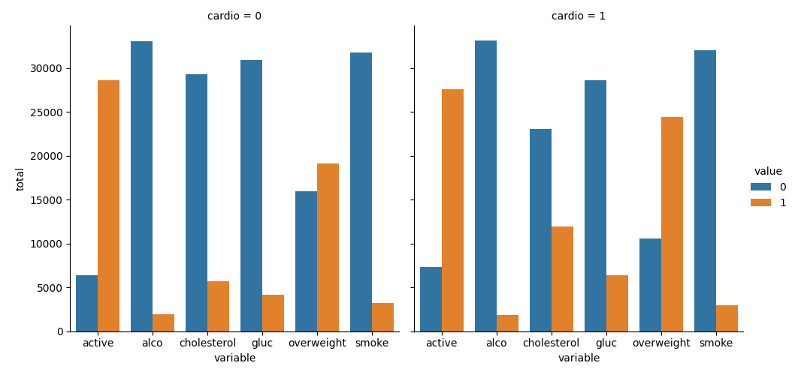
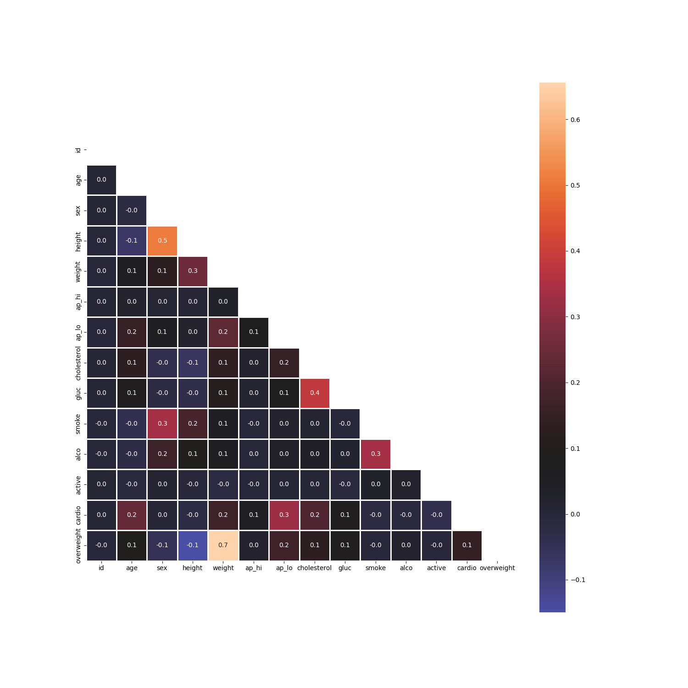

Выполняемые действия:
  1. Создание нового столбца overweight на основе имеющихся данных.
  2. Нормализация столбцов cholesterol и gluc.
  3. Создания графика распределения показателей в зависимости от состояния сердца.
  4. Очистка показателей выбросов.
  5. Создание тепловой карты корреляционных зависимостей разных показателей.
Источник: Medical_examination.csv  
Пример пункта 3:

Пример пункта 5:

