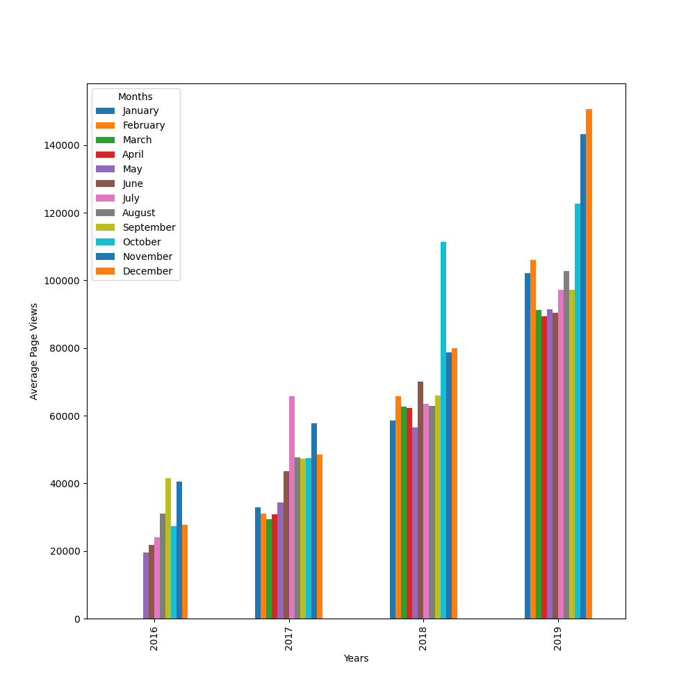

Цели:
1. Очистить данные от выбросов.
2. Отобразить динамику посещений во времени.
3. Визуализировать распределение по месяцам в каждом отдельном году.
4. Отобразить распределение просмотров в день по годам и по месяцам.  
Пример пункта 2:

Пример пункта 3:

Пример пункта 5:

Источник:
fcc-forum-pageviews.csv
