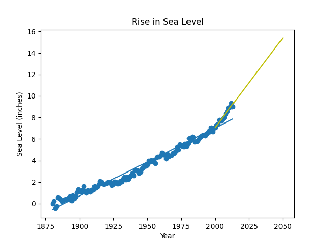

Цели:
1. Отобразить линейный график уровня моря в зависимости от времени.
2. Сделать трендовую линию, учитывая старые данные.
3. Продолжить трендовую линию, используя недавние значения.  
Пример графика:  
  
Источник: epa_sea_level.csv
